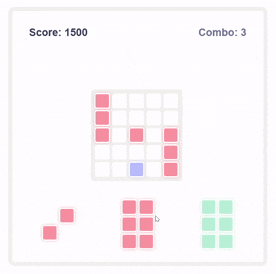
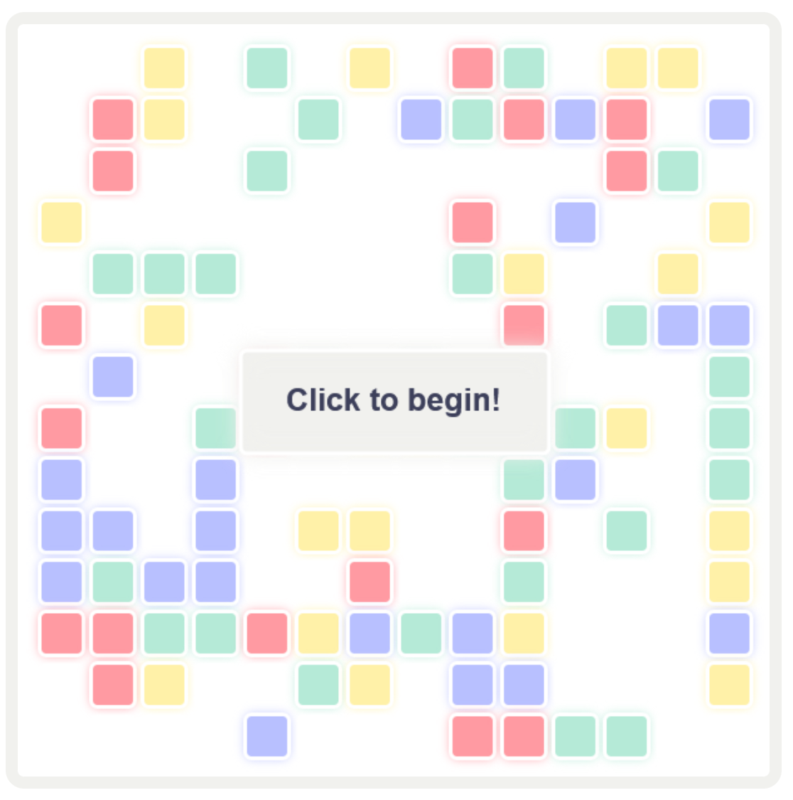

# Block-Blast
This is a game inspired by the popular mobile game Block Blast, created entirely in HTML canvas with no external libraries. This was my first time using JavaScript since I took coding classes, so it was a fun challenge to try to work in all of the logic and math.

## Features
The game includes a start and game over screen, block dragging, row and column checking, and a clean UI. I tried to keep code clean by creating seperate functions for all operations and game checks. I used <a src="coolers.co">coolers.co</a> to generate a palette for the game's colors!

## Gameplay
This is a very simple game, all you do is drag the blocks on the screen! If you can place any blocks anywhere on screen, you lose! The more rows / columns you complete in a row, the higher your combo will increase, giving more points.

## Screenshots
 
